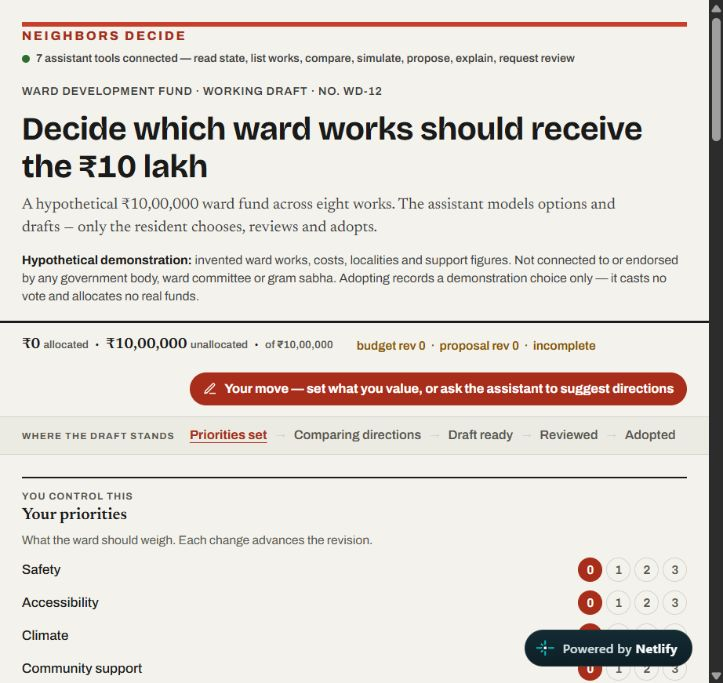
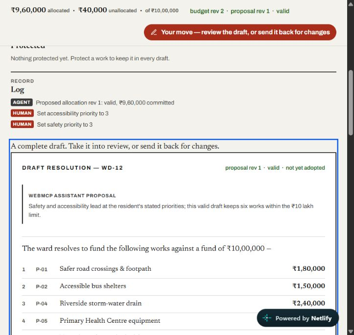
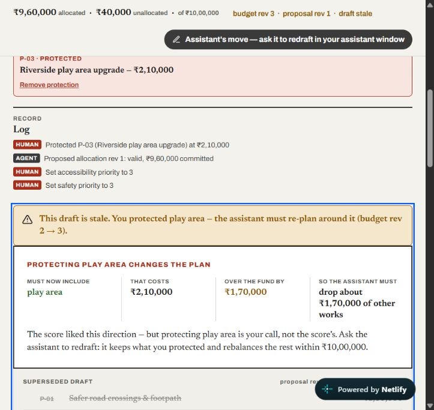
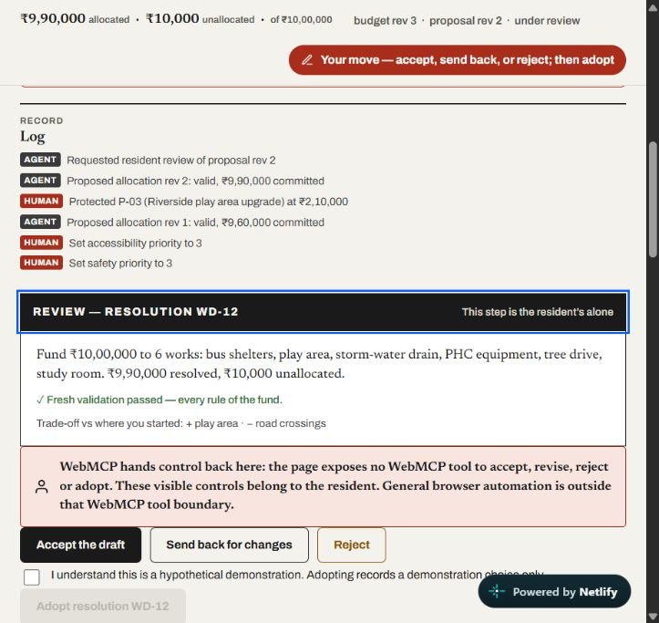
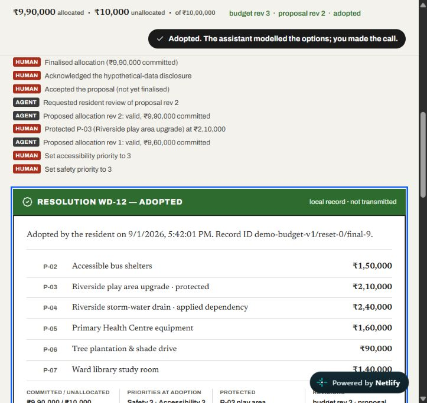

# Neighbors Decide — WebMCP Challenge submission

**Tagline:** Most WebMCP demos add tools so an agent can do more. This one is
defined by the tools it *withholds*: a browser agent can model, simulate and
draft an entire participatory-budget allocation, but there is no tool to set
priorities, protect a work, or adopt the resolution — the human-only boundary is
a function that was never registered on `document.modelContext`.

> **Hypothetical demonstration.** The ward, the eight works, their costs,
> localities and support figures are invented. "Neighbors Decide" is not
> affiliated with, endorsed by, or built for any government, municipality,
> panchayat, ward committee or participatory-budgeting programme. Porto Alegre,
> Kerala's People's Plan Campaign, the gram sabha and the 73rd/74th
> Constitutional Amendments are referenced only as historical and intellectual
> context. Adopting records a local demonstration choice — it casts no vote and
> moves no money.

---

## Before submitting — checklist

- [x] Repo pushed to public GitHub; MIT auto-detected; URL filled in **Links** below
- [ ] Video recorded in a real WebMCP runtime, uploaded public to YouTube, ≤ 3:00, audio on; URL filled in
- [x] Netlify wired to `main` for continuous deployment; live URL serves the latest build
- [x] Live URL re-verified end-to-end **in a real WebMCP browser** (full revision-bound journey)
- [ ] This document's substance pasted into the Devpost form
- [x] Screenshot evidence of the real-runtime journey linked below and from **Links**

---

## The idea *(judging: Creativity & Ambition, WebMCP Leverage)*

The race in agent tooling is to expose more actions. That has a blind spot: some
decisions are not ours to delegate. A budget that allocates public money, a
clinical consent, a loan denial, a hiring rejection, a court filing — each must
be attributable to a named person or body and contestable afterward. An agent
can and should do the work *around* such a decision: gather the facts, model the
options, quantify the trade-offs, draft a recommendation with reasons. It should
not make the call.

The usual answer is a confirmation dialog or a permission prompt. Both are weak:
people click through repeated prompts without deciding; prompts are a target for
prompt-injection and goal-drift; and an approval click leaves a thin audit trail
("the human approved the agent") when what is needed is "the human decided,
informed by the agent."

Neighbors Decide draws the boundary differently. The deciding actions are simply
**not present** in the agent's tool surface — not gated, absent. `document.modelContext`
carries seven tools that read, model, simulate, draft and hand off; it carries
nothing that commits. A cooperative agent has no function to call, and the
withheld list is shown on screen so the omission reads as a design, not a gap.

This is an **API authority boundary**, not a claim about browser security. A
determined agent can still type into the DOM. What omission buys is resident-UI
attribution within the WebMCP authority model, a legible division of labour, and
no WebMCP code path by which the assistant commits. This does not authenticate
who operates the browser UI.

## What it does *(judging: Execution / UX)*

One resident allocates a hypothetical **₹10,00,000** ward fund across **eight**
local works under interacting constraints (one work needs another first; two
share a road and can't both be funded; the tree drive comes in phases). A pure
deterministic engine — not the agent — enforces every rule.

The resident sets priorities, funds and protects works, reviews and adopts. The
agent reads the exact on-page state, compares three valid directions scored
against the resident's *current* priorities, simulates combinations, stores a
revision-bound proposal beside the resident's choices with its rationale, and
explains the trade-offs. When the resident changes anything, the agent's
proposal goes visibly **stale** and it must re-read and redraft — the agent
adapts to a moving human decision instead of returning one static answer.

The assistant's margin makes the machine interface observable: every WebMCP call
appears with its tool name, read/write mode, result and revisions. Ordinary page
clicks do not appear there. The demo ends with the resident acknowledging the
disclosure and adopting through a visible control, producing a transparent,
copyable local record attributed to `human_finalisation`.

When `document.modelContext` is absent, the page shows an honest fallback and
every manual flow still works, including a deterministic "rebuild the draft
around your protected work" — no hidden data, no false "tools registered" claim.

## How WebMCP is used *(judging: WebMCP Leverage)*

Seven tools on `document.modelContext`, each doing something the DOM cannot do
cleanly:

| Tool | Mode | Why it's a tool, not a click |
| --- | --- | --- |
| `get_budget_state` | read | Canonical revisions, amounts, statuses, whose turn it is, and `structuralLimits` — the actions no tool performs |
| `list_projects` | read | Structured costs, benefit ratings **and the numeric scoring model**, so the agent can reproduce every score it cites |
| `list_strategy_options` | read | Three valid directions, each scored at the resident's current priorities and its own lens |
| `simulate_allocation` | read | Runs the real validator; returns every constraint issue at once with a machine-readable `fix` |
| `propose_allocation` | write | Binds a proposal to a budget revision, validates it, keeps agent attribution; an invalid plan is still stored as a visible rejected draft |
| `explain_tradeoffs` | read | Canonical added/removed/funding/benefit deltas and opportunity costs |
| `request_allocation_review` | write | Atomic hand-off; proves the reviewed proposal is the exact validated revision |

**Deliberately not registered:** `set_priorities`, `protect_work`,
`accept_proposal`, `reject_proposal`, `adopt_resolution`, `reset`.

What makes it non-trivial:

- **Shared state, not a copy.** The React UI and every tool handler hold the same
  store instance and call the same `validateAllocation`. A tool read and the page
  cannot disagree.
- **Revision binding.** `budgetRevision` moves only on a human edit and instantly
  stales any active proposal; `proposalRevision` moves only when the agent
  proposes. Stale or fabricated revisions are rejected with structured errors.
- **Spec-idiomatic results.** Every tool returns the MCP `{ content,
  structuredContent }` shape with full `readOnlyHint` / `destructiveHint` /
  `idempotentHint` / `openWorldHint` annotations.
- **Invalid proposals stay inspectable** — stored with `status: "invalid"` and
  the issue list, not discarded.

## Implementation *(judging: Execution)*

- **Stack:** React 19 + TypeScript + Vite. No backend, no external API, no
  embedded LLM, no auth, no persistence. Static SPA.
- **`src/domain/`** — a pure, framework-free engine: the immutable 8-project
  dataset, one allocation validator with stable issue ordering, benefit scoring,
  canonical trade-off comparison, an order-independent allocation hash, the
  deterministic redraft-around-locks function, and the local final record.
- **`src/state/`** — one revisioned reducer/store. `human/*` vs `agent/*`
  actions; actor labels are derived from the action, never from tool input.
  Adoption re-checks freshness, allocation hash, review completion, fresh
  validation and the acknowledgement.
- **`src/webmcp/`** — tool contracts with JSON Schemas (all
  `additionalProperties: false`), handlers over the shared store,
  `registerTool(tool, { signal })` with a caller-owned abort signal that is
  StrictMode-safe, and a feature-detecting hook.
- **`src/components/`** — an accessible "ward gazette" workspace: semantic
  headings, fieldsets, tables, keyboard operation, a polite live region, status
  by icon + text (never colour alone).
- **Tests:** a Vitest / Testing Library suite across the validator, revision and
  staleness rules, actor attribution, the tool contract (including a test that
  no accept/adopt tool is registered), the MCP result shape, registration in
  supported and unsupported runtimes, and the full journey end to end.
  `npm test`, `npm run lint`, `npm run build` pass from a clean install.

## Where this pattern generalizes *(judging: Potential Impact)*

The build is deliberately hypothetical, so the impact claim is about the
*pattern* and its audience, not this app helping a resident tomorrow. The pattern
fits any decision where an agent can do the preparatory work but the act of
deciding must stay human and attributable:

| Domain | Agent may do | Human-only (no tool) |
| --- | --- | --- |
| Clinical informed consent | summarise the record, lay out options, quantify risk, draft the explanation | give or withhold consent; sign |
| Legal filing / settlement | draft, cite-check, model outcomes, compare offers | file with the court; execute the settlement |
| Lending / credit | pull the file, run affordability models, draft the adverse-action reasoning | approve, decline, set the rate |
| Hiring | screen against posted criteria, structure notes, draft the justification | advance, reject, extend the offer |
| Content moderation | classify, cite the policy, assemble precedent, draft the notice | remove, suspend, ban, restore |
| Participatory budgeting *(this demo)* | read the fund, simulate, compare directions, propose with rationale | set priorities, protect a work, accept, adopt |

In each, "boundary enforced by omission" beats a dialog for the same reasons:
no rubber-stamping, no injection target, a decision record with a human author,
no permission scope to widen, and a boundary you can explain to the affected
person in one sentence.

Participatory budgeting — from Porto Alegre to Kerala's local assemblies — has
always been about *who holds a decision*. This project asks the same question one
layer down: which actions belong on the API.

## Compatibility

- `document.modelContext` per the WebMCP spec and Chrome's imperative-API docs.
- Static SPA — deployable to any static HTTPS host.
- Graceful, fully-functional fallback when WebMCP is unavailable.

## Real WebMCP runtime evidence — 2026-09-01

Verified against the public deployment in the **ChatGPT desktop in-app browser**
at `https://neighbours-decide.netlify.app/`, using the page-discovered WebMCP
tools rather than DOM automation for agent actions.

Observed results:

- Exactly seven WebMCP tools registered; no priority, protection, acceptance,
  adoption or reset tool was exposed.
- `get_budget_state` returned budget revision 2 with Safety 3 and Accessibility
  3; `list_strategy_options` returned three structured directions.
- `simulate_allocation` returned `valid: true`; `propose_allocation` stored
  proposal revision 1 with `WEBMCP ASSISTANT PROPOSAL` attribution.
- Protecting P-03 through the resident UI advanced the budget to revision 3 and
  visibly staled proposal revision 1.
- The agent re-read revision 3, simulated and stored proposal revision 2 while
  preserving P-03 and its P-04 dependency; `explain_tradeoffs` reported P-01
  removed; `request_allocation_review` opened resident review.
- Adoption stayed disabled until the resident accepted and acknowledged the
  disclosure, then produced the local adopted record. Browser console: no
  warnings or errors.

### Screenshots

## What's next

- Adapt the dataset and rules to a published participatory-budget cycle, clearly
  labelled "reproduced for demonstration", so the scenario is concrete rather
  than invented.
- Extract the pattern as a small reference other WebMCP builders can adopt, plus
  a conformance check that asserts which committing tools a page does *not*
  expose.

## Links

- **Live demo:** https://neighbours-decide.netlify.app
- **Repo:** https://github.com/sandeepjagadeeshwork19-dotcom/WebMCP-Challenge
- **Demo video:** _(add public YouTube URL on upload)_
- **Demo script / shot list:** `docs/VIDEO.md`
- **Real WebMCP runtime evidence:** [registered tools](evidence/webmcp-01-registered-tools.png) · [agent proposal](evidence/webmcp-02-agent-proposal.png) · [stale after resident edit](evidence/webmcp-03-human-edit-stales-proposal.png) · [review hand-off](evidence/webmcp-04-replanned-review-handoff.png) · [final record](evidence/webmcp-05-final-record.png)
